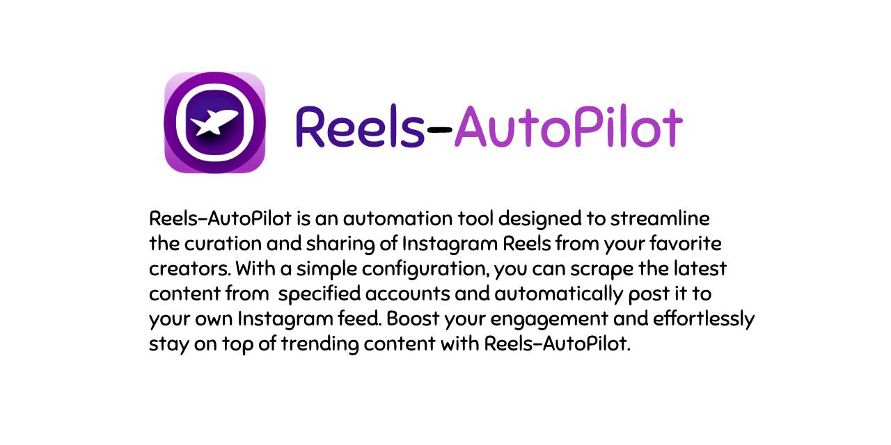

# Reels-AutoPilot

Reels-AutoPilot is a powerful GitHub repository that scrapes reels from specified Instagram accounts and shorts from YouTube channels, and automatically posts them to your Instagram account. Keep up with the latest content from your favorite creators and effortlessly share it with your followers. Enhance your Instagram presence and grow your account with Reels-AutoPilot!

# Active Sponsors
<a href="https://github.com/APeter" target="_blank"></a>

### Looking For Sponsors
<a href="https://www.buymeacoffee.com/avnsh1111" target="_blank"></a>
&nbsp;&nbsp;
<noscript><a href="https://liberapay.com/avnsh1111/donate"></a></noscript>

## Table of Contents

- [Getting Started](#getting-started)
    - [Prerequisites](#prerequisites)
    - [Installation](#installation)
    - [Initial Configuration](#initial-configuration)
    - [Generate a YouTube API Key](#generate-a-youtube-api-key)
- [Usage](#usage)
    - [Running App](#usage)
    - [Dashboard](#dashboard)
- [Contributing](#contributing)
- [License](#license)
- [Acknowledgements](#acknowledgements)
- [Additional Features](#additional-features)
- [Frequently Asked Questions](#frequently-asked-questions)
- [Troubleshooting](#troubleshooting)
- [Changelog](#changelog)

## Getting Started

Before using Reels-AutoPilot, set your configuration variables in the `config.py` file.

### Prerequisites

- Python 3.x
- A valid Instagram account
- A Google Developers Console project with the YouTube Data API enabled and an API key

### Installation

1. Clone the repository:

```bash
git clone https://github.com/avnsh1111/Instagram-Reels-Scraper-Auto-Poster.git
cd Instagram-Reels-Scraper-Auto-Poster
```

2. Install the required dependencies:

```bash
pip install -r requirements.txt
```

### Initial Configuration

Navigate to `src` directory:

```bash
cd src
```

To set up your initial configuration:

1. Run `start.py`:
```bash
python start.py
```

2. Follow the prompts to set up your Instagram credentials, YouTube API key, and other configuration settings.

After completing the setup process, the `src/app.py` script will run automatically based on your configuration settings.

### Generate a YouTube API Key

1. Set up a Google Developers Console project and enable the YouTube Data API:

   a. Go to the [Google Developers Console](https://console.developers.google.com/).
   
   b. Create a new project by clicking the project drop-down menu, then click "New Project" and fill in the required fields, or select an existing project from the list.
   
   c. In the Dashboard, click on "Enable APIs and Services" and search for the "YouTube Data API v3". Click on it and then click the "Enable" button.
   
   d. Create an API key by going to "Credentials" in the left-hand menu, then click on "Create credentials" > "API key".

2. During the initial configuration process, you'll be prompted to input your YouTube API key. Enter the key when prompted.

## Usage

### Scraping Reels, YouTube Shorts, and Posting

Run the `app.py` script to start the configured tasks (scraping reels, scraping shorts, and posting):

```bash
python app.py
```

Depending on the selected configuration options, this will scrape reels and shorts, store them in the `downloads` folder, and post them to your Instagram account at the specified interval.

### Dashboard

To see real-time updates, open a new terminal and run:

```bash
python dashboard.py
```

## Contributing

To contribute to this project, submit pull requests or open issues with your suggestions and ideas.

## License

Reels-AutoPilot is licensed under the GNU General Public License v3.0 - see the [LICENSE](LICENSE) file for details.

## Acknowledgements

- Thanks to all developers who contributed to the libraries used in this project.

## Additional Features

1. Reels and shorts scheduling: Schedule specific reels and shorts to be posted at certain times or dates.
2. Custom captions: Add custom captions to each reel or short when posting.
3. Multiple Instagram accounts: Support for posting reels and shorts to multiple Instagram accounts.
4. Auto-hashtag generation: Automatically generate relevant hashtags based on the content of a reel or short.
5. Analytics and insights: Collect data on the performance of your posted reels and shorts, such as views, likes, and comments.

## Frequently Asked Questions

#### Q: Can I run Reels-AutoPilot on a Raspberry Pi or similar devices?

A: Yes, Reels-AutoPilot can be run on a Raspberry Pi or any other device that supports Python 3.x and the required dependencies. However, you may need to adjust the configuration and installation steps to match the specific requirements of your device.

#### Q: Can I use Reels-AutoPilot for commercial purposes?

A: Reels-AutoPilot is released under the GNU General Public License v3.0, which allows you to use, modify, and distribute the software for both personal and commercial purposes. However, you must comply with the terms of the license, which includes providing the source code for any modifications you make and preserving the original copyright notices.

#### Q: Is it safe to use my Instagram account credentials with Reels-AutoPilot?

A: Reels-AutoPilot stores your Instagram account credentials in the `config.py` file, and they are used only for authenticating and posting reels andshorts to your account. However, make sure to keep your credentials secure and not share them with unauthorized parties. It is also recommended to use a secondary Instagram account for testing purposes before using your main account.

#### Q: Can I post reels and shorts from private Instagram accounts or YouTube channels?

A: Reels-AutoPilot can only scrape reels from public Instagram accounts and shorts from public YouTube channels. If you want to post content from private accounts or channels, you will need to obtain the necessary permissions and access to the content.

#### Q: Can I get banned from Instagram for using Reels-AutoPilot?

A: Reels-AutoPilot automates the process of posting reels and shorts to your Instagram account. While automation can potentially violate Instagram's terms of service, Reels-AutoPilot is designed to minimize the risk of getting banned by posting at regular intervals and not spamming your account. However, it is still recommended to use Reels-AutoPilot responsibly and at your own risk.

## Troubleshooting

1. **Issue**: Reels-AutoPilot is not scraping reels or shorts correctly.

   **Solution**: Ensure that the Instagram account usernames and YouTube channel links in `config.py` are correct and publicly accessible. Also, make sure that your YouTube API key is valid and has not exceeded the quota limits.

2. **Issue**: Reels-AutoPilot is not posting reels and shorts to my Instagram account.

   **Solution**: Verify that your Instagram account credentials in `config.py` are correct and that your account has not been banned or restricted. Additionally, check the `POSTING_INTERVAL_IN_MIN` and `SCRAPER_INTERVAL_IN_MIN` settings to ensure they are set to appropriate values.

3. **Issue**: I am receiving an error when running Reels-AutoPilot with Docker.

   **Solution**: Make sure you have properly installed and configured Docker on your system. Double-check the Docker build and run commands to ensure they are executed correctly. If the issue persists, consider running Reels-AutoPilot without Docker.

If you continue to face issues or need further assistance, please open an issue on the GitHub repository or reach out to the community for support.

## Changelog

- **v1.0.0** - Initial release with basic scraping and posting features.
- **v1.1.0** - Added support for scraping YouTube shorts and improved error handling.
- **v1.2.0** - Implemented Docker configuration and enhanced documentation.
- **v2.0.0** - Implemented added live dashboard, post-to-story feature, removed docker support and optimized login flow. 
